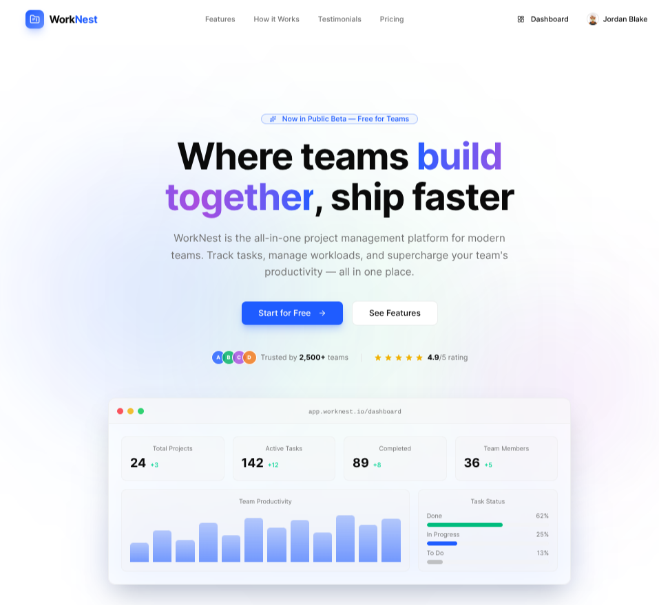

<div align="center">

# 🏢 WorkNest

### Full-stack project and task collaboration platform for modern teams

[](https://work-nest-adal.vercel.app/)
[](https://github.com/AdalOnShow/WorkNest-frontend)
[](https://github.com/AdalOnShow/WorkNest-backend)



</div>

---

## Demo Credentials

| Role | Email | Password |
|---|---|---|
| **Admin** | `admin@worknest.dev` | `Admin@worknest8` |
| **Project Manager** | `jordan@worknest.dev` | `PM@worknest8` |
| **Team Member** | `skyler@worknest.dev` | `TM@worknest8` |

---

## 🛠️ Tech Stack

<table>
<tr>
<td width="50%" valign="top">

### Frontend Technologies

| Technology                                                                                                              | Description            |
| ----------------------------------------------------------------------------------------------------------------------- | ---------------------- |
|                 | React Framework        |
|        | Type Safety            |
|  | Utility-First Styling  |
|          | Base UI Components     |
|                | Animated Components    |
|  | Server State     |
|              | Charts & Analytics     |
|  | Form Handling  |
|                             | Schema Validation      |
|                       | HTTP Client            |
|                    | Toast Notifications    |

</td>
<td width="50%" valign="top">

### Backend Technologies

| Technology                                                                                                              | Description              |
| ----------------------------------------------------------------------------------------------------------------------- | ------------------------ |
|               | Runtime Environment      |
|           | Web Framework            |
|        | Type Safety              |
|                    | ORM                      |
|        | Relational Database      |
|                   | Authentication           |
|                    | Password Hashing         |
|       | File Storage             |
|                             | Request Validation       |
|                    | Frontend Deployment      |

</td>
</tr>
</table>

---

## 📖 Table of Contents

- [About the Project](#-about-the-project)
- [Key Features](#-key-features)
- [Project Structure](#-project-structure)
- [API Documentation](#-api-documentation)
- [Installation](#-installation)
  - [Prerequisites](#prerequisites)
  - [Frontend Setup](#frontend-setup)
  - [Backend Setup](#backend-setup)
- [Contributing](#-contributing)
- [Contact](#-contact)

---

## 📃 About the Project

**WorkNest** is a full-stack project and task collaboration platform built for teams to manage projects, tasks, members, workloads, activities, and productivity. The platform supports role-based access control, project management, task tracking, analytics, comments, file attachments, and activity logging.

The system is designed for teams seeking unified project tracking, workload management, and real-time collaboration. Built with a strong focus on clean architecture, secure authentication, and efficient data flow.

### 🎯 Project Objectives

- Build a comprehensive collaboration platform featuring role-based dashboards, real-time activity feeds, file uploads, and analytics
- **Target Audience:** Teams of all sizes looking for unified project tracking
- **Deployment:** Frontend on Vercel, Backend on Render/Railway, Database on Neon PostgreSQL

### 📊 Key Metrics

✅ Role-Based Access Control (Admin, PM, Team Member)  
✅ JWT Authentication with HTTP-only Cookies  
✅ File Uploads via Cloudinary  
✅ Real-time Activity Logging  
✅ RESTful API Architecture  
✅ Responsive Design with shadcn/ui + Magic UI  
✅ TanStack Query for Server State  
✅ Zod Validation Throughout

---

## ✨ Key Features

### 1. 🔐 Authentication System

- JWT-based login, register, logout, and silent token refresh via HTTP-only cookies
- Role-based access (Admin, Project Manager, Team Member)
- Password hashing with bcrypt (min 8 chars, at least 1 number)
- Protected routes with `authenticate` + `authorize` middleware

### 2. 📁 Project Management

- Full CRUD with member management and scoped visibility
- PM auto-assignment on project creation
- Project status tracking (Active, Completed, Archived)
- Server-side search and filtering

### 3. ✅ Task Management

- Full CRUD with advanced filtering (status, priority, assignee, deadline)
- Unique task titles per project
- Status updates and assignment rules
- Completed tasks cannot be reassigned

### 4. 📊 Dashboard & Analytics

- Live platform-wide stats (total projects, tasks, completed, pending, overdue)
- Recharts analytics: task status, priority, team productivity, project progress
- Role-aware data views (Admin, PM, Member)

### 5. 💬 Comments

- Threaded task comments with author, message, timestamp, and delete support
- Ordered by creation date (ascending)
- Inline edit and Cmd+Enter to post

### 6. 🔔 Notifications

- Bell icon with unread badge in topbar
- Task-assignment alerts and due-date reminders
- Mark-read actions and real-time polling

### 7. 📎 File Attachments

- Upload images to tasks via Cloudinary (2MB max)
- Thumbnail previews and delete support
- Metadata stored in Attachment table

### 8. 📋 Activity Log

- Chronological project activity feed
- Logs: project create/update, task create/assign/complete, member add
- Global recent activity on dashboard

### 9. 🛡️ Admin Panel

- System-wide user management and status toggle
- Project listing and deletion
- Dedicated admin dashboard

### 10. 🔍 Search & Filtering

- Server-side search across projects, tasks, and members
- Filter by status, priority, assignee, and deadline
- Responsive sidebar with mobile-friendly layout

---

## 📁 Project Structure

```
worknest/
├── frontend/                    # Next.js Frontend
│   ├── app/                     # App Router pages
│   │   ├── (auth)/             # Login, Register
│   │   ├── (dashboard)/        # Protected dashboard routes
│   │   │   ├── projects/       # Project list & detail
│   │   │   ├── dashboard/      # Home dashboard
│   │   │   └── notifications/  # Notifications page
│   │   ├── (admin)/            # Admin panel routes
│   │   ├── onboarding/         # Onboarding flow
│   │   └── layout.tsx          # Root layout
│   ├── components/             # Reusable UI components
│   │   ├── activity/           # Activity feed
│   │   ├── auth/               # Auth forms
│   │   ├── dashboard/          # Dashboard stats & charts
│   │   ├── projects/           # Project components
│   │   ├── tasks/              # Task components
│   │   └── ui/                 # shadcn/ui primitives
│   ├── hooks/                  # Custom TanStack Query hooks
│   ├── lib/                    # API client & utils
│   ├── providers/              # Auth & Query providers
│   ├── services/               # API service layer
│   ├── types/                  # TypeScript definitions
│   └── public/                 # Static assets
│
└── backend/                     # Express Backend
    └── src/
        ├── app.ts              # Express app setup
        ├── server.ts           # Server entry point
        ├── config/             # Prisma, Cloudinary config
        ├── middlewares/        # Auth, upload, error handling
        ├── modules/            # Feature modules
        │   ├── auth/           # Register, login, refresh
        │   ├── user/           # Profile, avatar, delete
        │   ├── project/        # Projects & members
        │   ├── task/           # Tasks & filters
        │   ├── comment/        # Task comments
        │   ├── attachment/     # File uploads
        │   ├── activityLog/    # Activity tracking
        │   ├── notification/   # User notifications
        │   └── admin/          # Admin user/project mgmt
        └── utils/              # Helpers (hash, token, cookie)
```

---

## 📡 API Documentation

### Base URL

```
Production: https://work-nest-adal.vercel.app/api/v1
Local: http://localhost:5000/api/v1
```

### Authentication

Protected routes require JWT token via HTTP-only cookie. All requests from the browser send cookies automatically.

```
Authorization: Bearer <jwt_token>  // for manual testing
```

### Endpoints

#### Authentication

| Method | Endpoint     | Auth | Description              |
| ------ | ------------ | ---- | ------------------------ |
| `POST` | `/auth/register` | ❌ | Create account (auto-login) |
| `POST` | `/auth/login`    | ❌ | Login, set cookies       |
| `POST` | `/auth/logout`   | ✅ | Clear cookies, invalidate refresh token |
| `POST` | `/auth/refresh`  | ❌ | Refresh access token     |
| `GET`  | `/auth/me`       | ✅ | Get current user         |

#### Users

| Method   | Endpoint          | Auth      | Description              |
| -------- | ----------------- | --------- | ------------------------ |
| `PATCH`  | `/users/profile`  | Self only | Update name or avatar    |
| `DELETE` | `/users/me`       | Self only | Delete account           |

#### Projects

| Method   | Endpoint          | Auth                      | Description              |
| -------- | ----------------- | ------------------------- | ------------------------ |
| `POST`   | `/projects`       | Authenticated             | Create project (auto-PM) |
| `GET`    | `/projects`       | Authenticated             | List own projects        |
| `GET`    | `/projects/:id`   | Member of project         | Get project details      |
| `PATCH`  | `/projects/:id`   | Project Manager           | Update project           |
| `DELETE` | `/projects/:id`   | Project Manager           | Delete project           |
| `POST`   | `/projects/:id/members` | Project Manager     | Add member               |
| `GET`    | `/projects/:id/members` | Member of project  | List members             |
| `DELETE` | `/projects/:id/members/:id` | Project Manager | Remove member            |

#### Tasks

| Method   | Endpoint                          | Auth                      | Description              |
| -------- | --------------------------------- | ------------------------- | ------------------------ |
| `POST`   | `/projects/:id/tasks`             | Project Manager           | Create task              |
| `GET`    | `/projects/:id/tasks`             | Member of project         | List tasks (filterable)  |
| `GET`    | `/projects/:id/tasks/:taskId`     | Member of project         | Get task details         |
| `PATCH`  | `/projects/:id/tasks/:taskId`     | PM or Assignee            | Update task              |
| `DELETE` | `/projects/:id/tasks/:taskId`     | Project Manager           | Delete task              |

**Query Params:** `status`, `priority`, `assigneeId`, `deadlineStatus` (overdue | upcoming | none)

#### Comments

| Method   | Endpoint                          | Auth              | Description      |
| -------- | --------------------------------- | ----------------- | ---------------- |
| `POST`   | `/tasks/:taskId/comments`         | Member of project | Add comment      |
| `GET`    | `/tasks/:taskId/comments`         | Member of project | List comments    |
| `DELETE` | `/tasks/:taskId/comments/:id`     | Author of comment | Delete comment   |

#### Attachments

| Method   | Endpoint                          | Auth              | Description         |
| -------- | --------------------------------- | ----------------- | ------------------- |
| `POST`   | `/tasks/:taskId/attachments`      | Member of project | Upload file         |
| `GET`    | `/tasks/:taskId/attachments`      | Member of project | List attachments    |
| `DELETE` | `/tasks/:taskId/attachments/:id`  | Uploader only     | Delete attachment   |

#### Activity Logs

| Method   | Endpoint                          | Auth              | Description                   |
| -------- | --------------------------------- | ----------------- | ----------------------------- |
| `GET`    | `/activity/project/:id`           | Member of project | Paginated project activity    |
| `GET`    | `/activity/recent`                | Authenticated     | Recent activity across projects |

#### Notifications

| Method   | Endpoint                          | Auth          | Description                   |
| -------- | --------------------------------- | ------------- | ----------------------------- |
| `GET`    | `/notifications`                  | Authenticated | Get current user notifications|
| `PATCH`  | `/notifications/:id/read`         | Authenticated | Mark notification as read     |
| `PATCH`  | `/notifications/read-all`         | Authenticated | Mark all as read              |

#### Dashboard

| Method   | Endpoint                          | Auth          | Description                   |
| -------- | --------------------------------- | ------------- | ----------------------------- |
| `GET`    | `/dashboard/admin`               | Admin         | Admin-specific stats & charts |
| `GET`    | `/dashboard/pm`                  | Project Manager | PM-scoped stats & charts  |
| `GET`    | `/dashboard/member`              | Team Member   | Member-specific stats & charts|

#### Admin

| Method   | Endpoint                          | Auth  | Description              |
| -------- | --------------------------------- | ----- | ------------------------ |
| `GET`    | `/admin/users`                   | Admin | List all users           |
| `PATCH`  | `/admin/users/:id/status`        | Admin | Activate/deactivate user |
| `DELETE` | `/admin/users/:id`               | Admin | Delete user              |
| `GET`    | `/admin/projects`                | Admin | List all projects        |
| `DELETE` | `/admin/projects/:id`            | Admin | Delete project           |

---

## ⚙️ Installation

### Prerequisites

- Node.js >= 18.x
- pnpm >= 9.x
- PostgreSQL (Neon or local)
- Cloudinary account
- Git

### Frontend Setup

1. **Navigate to frontend directory**

   ```bash
   cd frontend
   ```

2. **Install dependencies**

   ```bash
   pnpm install
   ```

3. **Configure environment variables**

   Create a `.env.local` file in the `frontend` directory:

   ```env
   NEXT_PUBLIC_API_URL=http://localhost:5000/api/v1
   ```

4. **Run the development server**

   ```bash
   pnpm dev
   ```

5. **Build for production**

   ```bash
   pnpm build
   ```

6. **Start production server**

   ```bash
   pnpm start
   ```

### Backend Setup

1. **Navigate to backend directory**

   ```bash
   cd backend
   ```

2. **Install dependencies**

   ```bash
   pnpm install
   ```

3. **Configure environment variables**

   Create a `.env` file in the `backend` directory:

   ```env
   DATABASE_URL=
   JWT_ACCESS_SECRET=
   JWT_ACCESS_EXPIRES_IN=15m
   JWT_REFRESH_SECRET=
   JWT_REFRESH_EXPIRES_IN=7d
   CLOUDINARY_CLOUD_NAME=
   CLOUDINARY_API_KEY=
   CLOUDINARY_API_SECRET=
   CLIENT_URL=http://localhost:3000
   PORT=5000
   NODE_ENV=development
   ```

4. **Run database migrations**

   ```bash
   pnpm prisma migrate dev
   pnpm prisma db seed
   ```

5. **Start the server**

   ```bash
   pnpm dev
   ```

   The server will start on `http://localhost:5000`

---

## 🤝 Contributing

Contributions are always welcome! Here's how you can help:

### Steps to Contribute

1. **Fork the Project**
2. **Create a Feature Branch**
   ```bash
   git checkout -b feature/AmazingFeature
   ```
3. **Commit Your Changes**
   ```bash
   git commit -m 'Add some AmazingFeature'
   ```
4. **Push to the Branch**
   ```bash
   git push origin feature/AmazingFeature
   ```
5. **Open a Pull Request**

---

## 📬 Contact

**Sharif Adal**

[](https://www.linkedin.com/in/AdalOnShow/)
[](mailto:adalonshow@gmail.com)

### 🔗 Project Links

- **Live Demo:** [https://work-nest-adal.vercel.app/](https://work-nest-adal.vercel.app/)
- **Client Repository:** [WorkNest-frontend](https://github.com/AdalOnShow/WorkNest-frontend)
- **Server Repository:** [WorkNest-backend](https://github.com/AdalOnShow/WorkNest-backend)
- **Portfolio:** [sharif-adal.web.app](https://sharif-adal.web.app/)

---

<div align="center">

Built as a full-stack demonstration of modern web development practices: modular architecture, role-based access control, real-time collaboration flows, file uploads, and production-ready CI/CD pipelines.

Made with ❤️ by [Adal](https://github.com/AdalOnShow)

⭐ Star this repo if you find it helpful!

</div>
